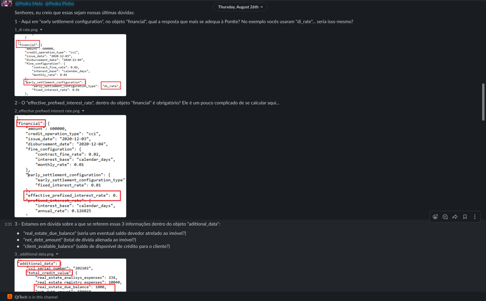
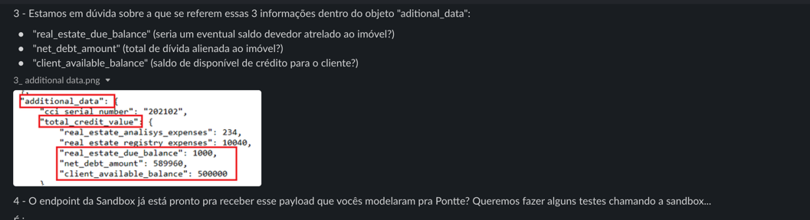

- confirmando não temos de nenhum documento obrigatório pra gerar uma divida
- o campo cci_number no payload pode ir vazio ?
- como funciona a geração do nuero da cci?

  - o webhook nos retorna um debt_key esse debtKey é o numero da cci ou um id interno de vcs?

- estamos batendo no endpoint e recebendo erro
  - chaves no payload novo que não estão na doc official são rejeitadas pelo endpoint

1 - Aqui em "early settlement configuration", no objeto "financial", qual a resposta que mais se adequa à Pontte? No exemplo vocês usaram "di_rate"... seria isso mesmo?
2 - O "effective_prefixed_interest_rate", dentro do objeto "financial" é obrigatório? Ele é um pouco complicado de se calcular aqui...

3 - Estamos em dúvida sobre a que se referem essas 3 informações dentro do objeto "aditional_data":
"real_estate_due_balance" (seria um eventual saldo devedor atrelado ao imóvel?)
"net_debt_amount" (total de dívida alienada ao imóvel?)
"client_available_balance" (saldo de disponível de crédito para o cliente?)

4 - O endpoint da Sandbox já está pronto pra receber esse payload que vocês modelaram pra Pontte? Queremos fazer alguns testes chamando a sandbox...

[comment]: <> (range de datas pensar na possibilidade)

item `h`
do contrato que eles tem conostco

valor avaliação do imovel
client_available_balance valor disponivel ao cliente nesta data
[comment]: <> (net debt amount quando temos dividas que vão ser quitadas)

